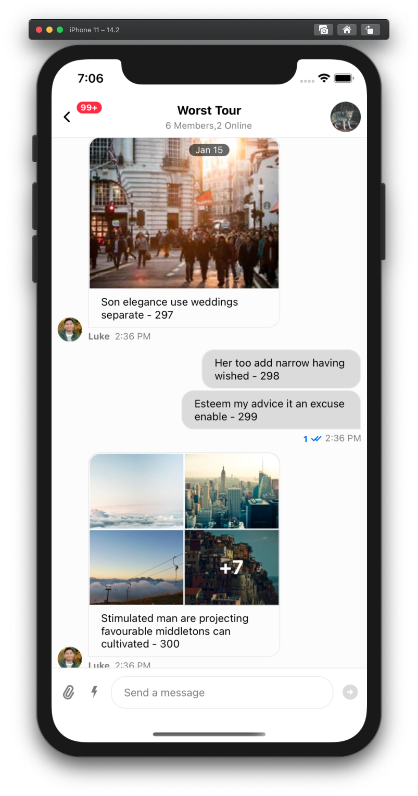

# Tool for generating beautiful chat data.

## 𓀠 What is it for?

Testing is boring when you see messages like `asdasdassdas`, `kemdlwemkd`, `gegsfgsdfsd` on the chat screen.
This internal tool for Stream will generate a nice set of data (which is pleasant for eye of dev and tester), which contain reactions, attachments, enriched urls replies etc etc. Feel free to add comments in issues sections for improvement :)

<div style="display: inline">
    
    
    
</div>

## 🔧 Setup

1. Clone the repo

```sh
# Clone the repo
git clone git@github.com:GetStream/stream-chat-test-data-cli.git

# Go to directory
cd stream-chat-test-data-cli

# Install the dependencies and link the repo
yarn; yarn link;
```

2. Create config file.

```sh
# Create a copy of your config.
cp config.js.template dev.config.js
```

**NOTE For SDK Teams**

You can use the template file for corresponding team
e.g., flutter.config.js.template contains appUsers from Flutter team.

```sh
cp flutter.config.js.template dev.config.js
```

**NOTE:** `dev.config.js` gets used by default in all commands. Each SDK team will maintain their own config file for their dev app, on their local environment.

3. Please set the credentials in both the files such as `apiKey` and `secret` in `dev.config.js`. Please check other parameters as well.

## 🎙 Usage

Most basic command that you will use is `create-channels`. It serves two purposes:

- Create initial data for the app
- And reset/repopulate the messages on channels at some point in future. Data will be reset only for
  the channels with prefix specificed in config.

You may want to pay attention to few config params before running the command for first time

- apiKey and secret (ofc)
- channelType
- channelIdPrefix
- appUsers

```sh
# By default command uses dev.config.js
create-channels
```

You can create multiple config files in root directory.

```sh
create-channels --config custom.config.js
```

## 📚 Command docs

Docs for all the commands is available here - https://github.com/GetStream/stream-chat-test-data-cli/blob/master/doc.md

## 📝 Configuration options

Following config options are available

https://github.com/GetStream/stream-chat-test-data-cli/blob/master/config.js

## 📜 Reference guide

### Want to reset the messages on channels (created using `create-channels`)?

This will only reset channels with `channelIdPrefix`, mentioned in your config file.
Use [reset-all-channels](https://github.com/GetStream/stream-chat-test-data-cli/blob/master/doc.md#reset-all-channels---help) instead, if you want to reset all the channels.

```sh
reset-channels
```

### Want to create new set of channels?

- Change channelIdPrefix in config
- Set any `customProperties` if you want

```sh
create-channels
```

### Want to reset messages on ALL the channels on your app?

```sh
reset-all-channels
```

### Want to add bunch of messages in particular channel?

```sh
add-messages --channelId "default-channel-0" --number 50
```

### Want to increase unread count in channel?

So basically you want to add bunch of messages to channel, but not from your current logged in user.

```sh
# 50 messages will be added from other members of channel, other than vishal
add-messages --channelId "default-channel-0" --number 50 --excludeUser "vishal"
```

### Want to test channel with lot of members?

```sh
# 30 new randomly generated users will be added as members.
create-channel-members --channelId "default-channel-0" --number 30
```

### Want to add a new user on your app?

```sh
create-user --id "vishal" --name "Vishal Narkhede" --image "user"
```

### Want to create a bunch of new users?

```sh
create-app-users --number 10
```

There are bunch of more commands available, please check the next [Command Docs](https://github.com/GetStream/stream-chat-test-data-cli/blob/master/doc.md) part.

### Want to play around some code?

You can use `bin/playground.js` for it.

```sh
playground
```

## Contribute

If you want to add a new command:

1. Create a script file

```sh
cp bin/playground.js bin/<command-name>.js
```

2. Add your command to `package.json` file,

```js
...
"bin": {
  ...
  "<command-name>": "bin/<command-name>.js"
}
```

3. Relink the project

```sh
yarn unlink && yarn link
```

4. Try it

```sh
<command-name>
```

5. To add the command to [command docs](https://github.com/GetStream/stream-chat-test-data-cli/blob/master/doc.md)

Go to `bin/generate-docs.js` and add new command to `executables` array.

And then

```sh
yarn build
```
