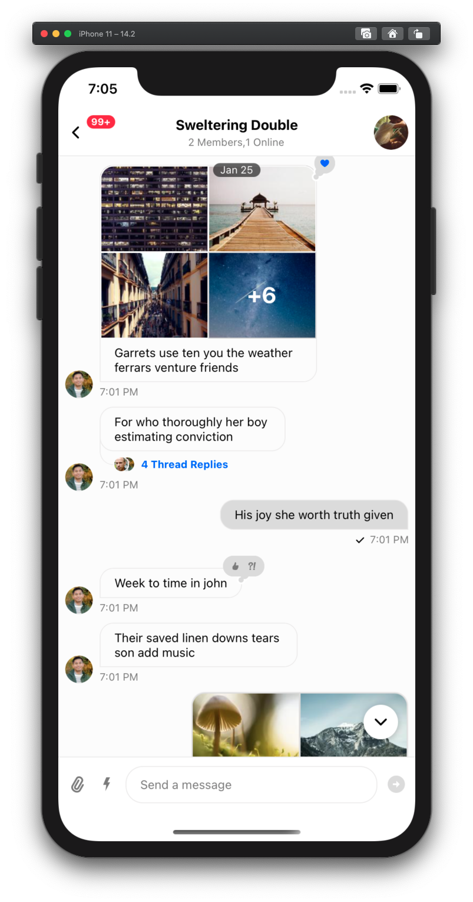

# Tool for generating beautiful chat data.

## What is it for?

Testing is boring when you see messages like `asdasdassdas`, `kemdlwemkd`, `gegsfgsdfsd`  on the chat screen.
This internal tool for Stream will generate a nice set of data (which is pleasant for eye of dev and tester), which contain reactions, attachments, enriched urls replies etc etc. Feel free to add comments in issues sections for improvement :)

Jump to [Usage Section](#usage)

## Screenshots

<div style="display: inline">
    
    
    
</div>

## Usage

```sh
git clone git@github.com:GetStream/stream-chat-test-data-cli.git
cd stream-chat-test-data-cli

# After this open ./config.js, and add your API_KEY and SECRET.
# Change the other configuration as well if you want.

yarn;
yarn run create-channels
```

You can create multiple config files in root directory.

```sh
yarn run create-channels --config custom.config.js
```

## Configuration options

Following config options are available

```js

API_KEY: '',
SECRET: '',

/**
 * Custom field for channels
 * 
 * This is also used for generating channelId - `channel-ex-${EXAMPLE}-${i}`,
 * where i is the for-loop index (0 to NUMBER_OF_GROUP_CHANNELS)
 * 
 * So as long as EXAMPLE and NUMBER_OF_GROUP_CHANNELS field doesn't change, we won't be creating any new channels
 * for multiple iterations of create-channels script.
 */
EXAMPLE: 'test-data-1',

/**
* Group channels will be created with these users (id) as members
* First user of this list will be the creator of channel (since we are using server token for generating channels).
* 
* If the users don't exist, then set `CREATE_USERS` as true, so that the script will create/generate these
* users first, before proceeding to channel creation.
* 
*/
USERS: ['salvatore', 'grant', 'neil', 'vir', 'bahadir', 'alexey', 'seni'],
/**
 * If true, users will be first created (if they don't exist in app).
 * Name will be same as userID, with first letter capitalized
 * Some random user avatar will be added for user.
 */
CREATE_USERS: true,

CHANNEL_TYPE: 'messaging',
/** Total number of group channels to create */
NUMBER_OF_GROUP_CHANNELS: 5,
/**
 * Channel names will be some random combination of adjective and verb.
 * but if you want to have your own channel names then specify then here.
 * If NUMBER_OF_GROUP_CHANNELS is greater than length of FIXED_CHANNEL_NAMES, then for remainder of channels, name will
 * be auto generated.
 */
FIXED_CHANNEL_NAMES: [/** stream_chat, amsterdam_office */],

/** If true, script will also create one-to-one conversation between all users. */
CREATE_ONE_ON_ONE_CONVERSATIONS: true,

NUMBER_OF_MESSAGES_PER_CHANNEL: 30,
/** So number of attachments will vary between 1 and MAX_NUMBER_OF_ATTACHMENTS_PER_MESSAGE */
MAX_NUMBER_OF_ATTACHMENTS_PER_MESSAGE: 6,


/** Following reactions will be randomly added to messages. */
reactions: [
    'like',
    'love',
    'haha',
    'wow',
    'sad',
    'angry',
],

/** Messages will contain following urls once in a while */
urls: [
    'https://www.youtube.com/watch?v=MhCEdIqFCck',
    'https://getstream.io',
    'https://blog.bitsrc.io/code-principles-every-programmer-should-follow-e01bfe976daf',
    'https://www.youtube.com/watch?v=ciNHn38EyRc',
    'https://blog.feathersjs.com/design-patterns-for-modern-web-apis-1f046635215?'
],
language: 'en'
```